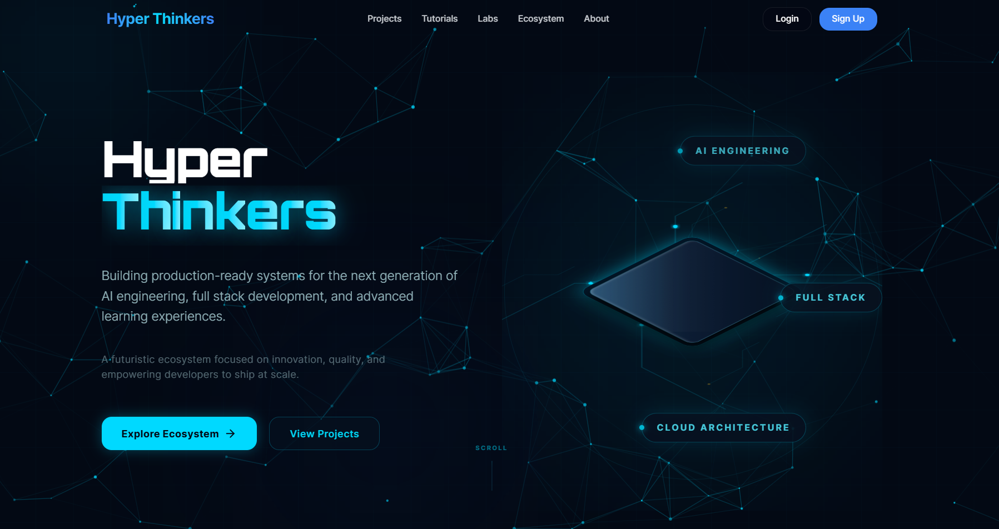

# 🚀 Hyper Thinkers

**Building production-ready systems for the next generation of AI engineering, full stack development, and advanced learning experiences.**



*A futuristic ecosystem focused on innovation, quality, and empowering developers to build, learn, and grow.*

---

## 🌐 What is Hyper Thinkers?

Hyper Thinkers is a connected ecosystem focused on helping people learn, plan, build, and showcase real software products through education, AI guidance, and collaborative developer platforms.

Built especially for:

* Students
* Beginner developers
* Self-taught builders
* Aspiring founders
* Non-technical creators trying to build software

---

## 🎯 Vision

The long-term vision of Hyper Thinkers is:

> To help people learn, plan, build, and showcase real software products through education, AI guidance, and collaborative developer platforms.

The ecosystem combines:

* Education
* Engineering
* AI
* Product Thinking
* Community

into one connected environment.

---

## 🏗️ Ecosystem Structure

| Product            | Purpose                                     |
| ------------------ | ------------------------------------------- |
| **Hyper Thinkers** | Parent organization & ecosystem hub         |
| **Hyper Learning** | Digital learning platform                   |
| **Hyper Hub**      | Developer showcase & collaboration platform |
| **Hyper AI**       | AI product architect & workflow system      |

---

## 🔗 Ecosystem Roadmap

```text
Step 1 → Learn concepts         [Hyper Learning]  - Planned To Migrate
Step 2 → Plan your idea         [Hyper AI]        - Coming Soon
Step 3 → Build & Showcase       [Hyper Hub]       - Coming Soon
Step 4 → Stay in Ecosystem      [Hyper Thinkers]  - In Progress
```

This ecosystem is being developed incrementally, with Hyper Thinkers serving as the foundation for future products.

---

## 📦 Current Project Status

### ✅ Available Now

* Hyper Thinkers Website
* Landing Page
* Dashboard
* Authentication System
* Responsive UI
* Ecosystem Showcase

### 🚧 In Development

* Hyper Learning
* Hyper AI
* Hyper Hub
* Learning Content
* Labs Section
* Community Features

---

## 🎓 Hyper Learning

A future learning platform focused on practical engineering education.

### Goals

* Structured learning resources
* Project-based learning
* Engineering-focused tutorials
* Real-world software development guidance
* AI-assisted education experiences

---

## 🤖 Hyper AI

An AI-powered product architect designed for beginner software creators.

### Core Concept

Instead of only generating code, Hyper AI helps users:

* Plan products
* Clarify requirements
* Choose technologies
* Build roadmaps
* Understand architecture decisions

### Long-Term Goal

> An AI Operating System for Beginner Software Creation.

---

## 🤝 Hyper Hub

A future developer collaboration and project showcase platform.

### Planned Features

* Project portfolios
* Builder profiles
* Collaboration opportunities
* Developer networking
* Public project showcases

---

## 🛠️ Current Tech Stack

The current Hyper Thinkers website is built using:

| Category       | Technology   |
| -------------- | ------------ |
| Framework      | Next.js      |
| Language       | TypeScript   |
| Styling        | Tailwind CSS |
| Authentication | Clerk        |
| UI Components  | React        |
| Deployment     | Vercel       |

---

## 💡 Core Philosophy

Hyper Thinkers focuses on:

* Production-ready engineering
* Real-world project building
* AI-assisted creation
* Practical learning
* Builder empowerment
* Open collaboration

Instead of:

* Shallow tutorials
* Repetitive clone projects
* Random AI code generation
* Isolated learning experiences

---

## 🚀 Future Vision

Future ecosystem expansion may include:

* Engineering research
* AI tools
* Startup incubation
* Developer communities
* Project accelerators
* Technical mentorship

---

## 🎯 Mission

> Helping people think clearly, build real software, and grow as creators and engineers.

---

## 🚧 Project Status

**Work In Progress**

Hyper Thinkers is actively evolving into a complete ecosystem for learning, planning, building, and showcasing production-ready software products.

---

## 🤝 Contributing

Contributions, feedback, ideas, and discussions are welcome.

```bash
git clone https://github.com/imuniqueshiv/Hyper-Thinkers.git
cd hyper-thinkers
npm install
npm run dev
```

---

## 📬 Connect

* 🌐 Hyper Thinkers
* 💻 Open Source Development
* 🚀 Builder Ecosystem
* 🤖 AI-Powered Product Creation

---

## 📄 License

© 2026 Hyper Thinkers. All rights reserved.
